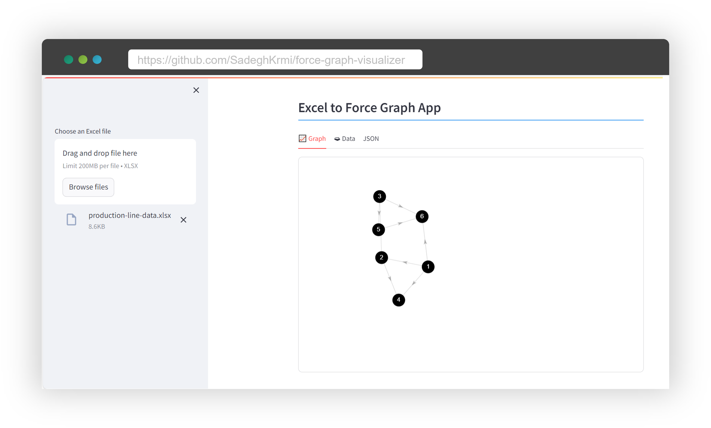

### force-graph-visualizer
We are using the force-graph javascript repo [here](https://github.com/vasturiano/force-graph).

#### Streamlitify ;)



Clone the repo and run the following commands in Linux:
```bash
python3 -m venv .venv
source .venv/bin/activate
pip install -r requirements.txt
streamlit run app.py --server.address 0.0.0.0 --server.port 8501
```
open the browser and head to the server_ip_address:8501.
